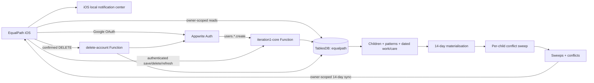

# EqualPath Appwrite backend

This folder is the deployable Appwrite backend for the EqualPath iOS handoff. Authentication is Google OAuth through Appwrite Auth; the app does not maintain a separate password or registration system.

## What is implemented

- One `equalpath` TablesDB database with 15 row-secured tables, 168 columns, and 37 indexes.
- Google OAuth user provisioning: `users.*.create` creates the private profile row whose row ID is the Appwrite Auth user ID.
- An authenticated mutation boundary. iOS reads its permitted rows directly, but all writes go through `iteration1-core`; the Function forces `user_id` from the authenticated execution header and assigns owner permissions.
- Weekly work/care patterns expanded into a rolling 14-day local-date window.
- Owner-scoped dated work, required-care and care-coverage create/edit/delete, including cross-midnight spans stored as two linked local-day rows.
- Independent care state per child, interval merging/subtraction, work overlap detection, and bidirectional handover gaps based on drop-off/collection responsibility and three user-entered travel estimates.
- `unknown` is kept separate from `uncovered` and never silently converted into a gap.
- Durable `sweeps` and `conflicts`. A failed scan is recorded and cannot clear previously visible conflicts.
- Hourly scheduled maintenance of the 14-day conflict window. The iOS app reads those owner-scoped results and schedules privacy-minimal reminders locally on the device.
- Account deletion that withdraws outstanding confirmation requests, erases owned rows, and deletes the Appwrite Auth user last.

The data model for generated plans, plan segments, feedback, support contacts, and confirmation requests is provisioned. Plan solving and outbound carer/provider request delivery are later-iteration services; they are not represented as complete in this package.

## Runtime architecture



The backend does not send reminder messages and has no `messages.write` scope. After a successful sync, iOS replaces its pending local requests for the next 14 days. This requires no APNs provider, device token, or paid Apple Developer Program membership. If cloud data changes while the app remains closed, the device refreshes its pending reminders the next time EqualPath opens or returns to the foreground.

At function runtime, both Functions authenticate their server SDK clients with the per-execution `x-appwrite-key` request header. `APPWRITE_FUNCTION_API_KEY` is retained only as a local-development/build-time compatibility fallback; it must not be assumed to exist during a cloud execution.

## Tables

| Area | Tables | Ownership |
|---|---|---|
| Identity | `users`, `children` | Private owner rows |
| Source schedule | `schedule_patterns`, `work_commitments`, `care_commitments` | Private owner rows; Function-only mutation |
| Detection | `sweeps`, `conflicts` | Server-written, owner-readable |
| Planning | `support_network`, `plans`, `plan_segments`, `plan_feedback`, `confirmation_requests` | Private owner rows |
| Reference data | `childcare_providers`, `district_population`, `strategy_library` | Public/authenticated read as configured |

Local schedules use `date_local` (`YYYY-MM-DD`) and minute-of-day boundaries. This avoids treating a weekly local schedule as a naive UTC timestamp. Every generated day band keeps source records for explanation and review.

## Function contracts

Both Functions have execute access `users`, so direct calls require an Appwrite session.

`iteration1-core` accepts these JSON bodies:

```json
{ "action": "initial_sweep" }
```

```json
{
  "action": "update_profile",
  "data": {
    "travel_home_care_min": 20,
    "travel_care_work_min": 30,
    "travel_home_work_min": 35,
    "notify_hour": 21,
    "onboarding_completed": true
  }
}
```

```json
{
  "action": "save_row",
  "table_id": "schedule_patterns",
  "row_id": "optional_existing_or_client_id",
  "data": {
    "kind": "care_coverage",
    "child_id": "child_row_id",
    "byweekday": ["MON", "TUE", "WED", "THU", "FRI"],
    "start_minute": 480,
    "end_minute": 1020,
    "effective_from": "2026-08-31",
    "payload_json": "{\"collect_by_minute\":960,\"handover_in_ref\":\"owner\",\"handover_out_ref\":\"owner\",\"source_label\":\"School\"}",
    "active": true
  }
}
```

```json
{ "action": "delete_row", "table_id": "support_network", "row_id": "support_row_id" }
```

Supported mutation tables are `children`, `schedule_patterns`, `work_commitments`, `care_commitments`, `support_network`, and `plan_feedback`. `prune_schedule_span` removes obsolete linked continuation rows after a cross-midnight edit. Server fields and a client-supplied `user_id` are ignored.

`delete-account` requires an explicit destructive confirmation:

```json
{ "confirm": "DELETE" }
```

## Deploy

1. Appwrite project `EqualPath` is configured in Singapore with Project ID `6a916a6c0030a70a9d75`.
2. The registered Apple platform uses Bundle ID `com.equalpath.ios`.
3. Install and validate locally:

   ```sh
   npm install
   npm run check
   npm test
   ```

4. Authenticate the CLI and push resources:

   ```sh
   npx appwrite login
   npm run push:tables
   npm run push:functions
   ```

5. Google OAuth is enabled in Appwrite. The Google Cloud project is `equalpath-ios-6a916a6c`, the Appwrite callback URL is registered, and the project-owner account is an OAuth test user. The Google client secret is stored only in Appwrite.
6. No Appwrite Messaging or APNs provider is required. Notification permission and scheduling are handled by the iOS app on each device.
7. Use the iOS settings in [IOS_INTEGRATION.md](./IOS_INTEGRATION.md).

The Functions receive their project ID, endpoint, and dynamic scoped key from Appwrite. Never place an Appwrite server API key or Google client secret in the iOS target.

## Verification

```sh
npm run check
npm test
npx appwrite --version
```

The current 34-test suite covers interval edge cases, cross-midnight splitting, unknown vs gap state, inbound and outbound handover travel, responsibility assignment, child isolation, deterministic priority and identity, idempotent recalculation and materialisation, single-day override preservation, resolution reasons, failed-scan retention, mutation ownership, deletion/tombstone ordering, span pruning, and runtime dynamic-key precedence. The numbered Iteration 1 evidence map is in [ITERATION1_VERIFICATION.md](./ITERATION1_VERIFICATION.md).
